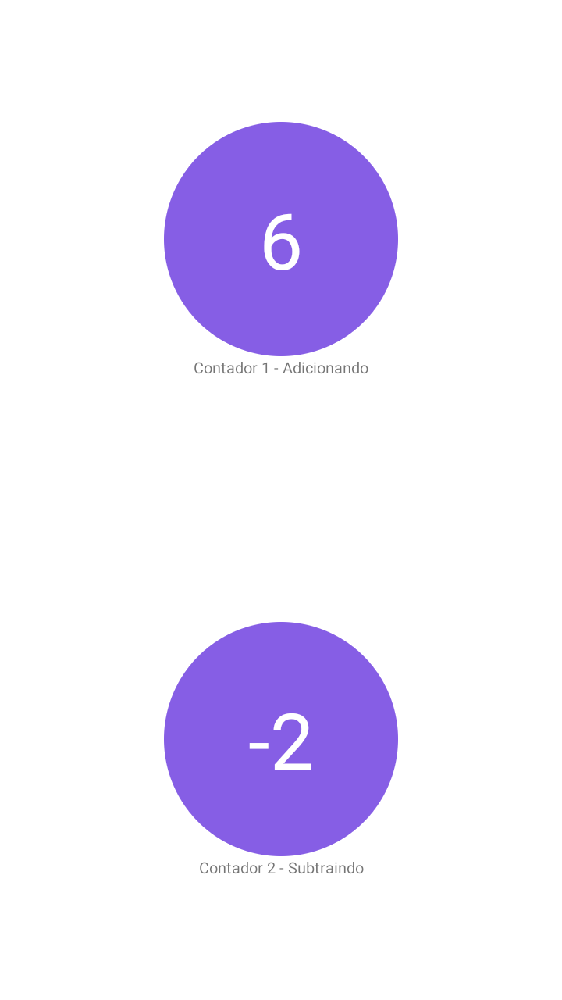

<h1 align="center">
  Simple Counter
  <br>
</h1>

<p align="center">
  
</p>

## 🌐 Technologies Used
Technologies were used:

- [React Native](https://reactnative.dev/)
- [Yarn](https://yarnpkg.com/)
- [Hook useState](https://pt-br.reactjs.org/docs/hooks-state.html)
- [Hook useContext](https://pt-br.reactjs.org/docs/hooks-reference.html#usecontext)
- [Redux](https://redux.js.org/)

## 📱 How To Use 

To execute the project it is necessary that you have the React Native environment configured, you can follow this [GUIA](https://reactnative.dev/docs/environment-setup).

After setting up the environment, just clone the project:

```sh
git clone https://github.com/JhonatanBergmann/simple-counter-redux.git
```

Enter the project folder and run the command to install the project's dependencies:

```sh
yarn install
```
or
```sh
npm install
```

Then run the command for the platform you want to run on:

Android:

```sh
react-native run-android
```

## 📝 License

This project is under the MIT license. See the archive [LICENSE](LICENSE) for more details.

---

<p align="center">
 Done with 💜 by Jhonatan Bergmann
</p>
